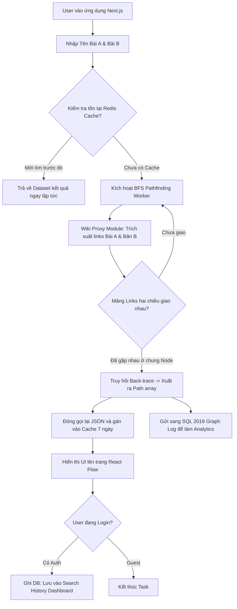

# PRODUCT SPECIFICATION: Six Degrees of Wikipedia

## 1. Executive Summary
Dự án "Six Degrees of Wikipedia" là một ứng dụng đa ngôn ngữ cho phép tìm ra con đường ngắn nhất giữa hai bài viết (hoặc nhân vật) Wikipedia thông qua các liên kết nội bộ trực tiếp. App hoạt động thời gian thực bằng việc gọi API của Wikipedia, giúp user chứng minh được giả thuyết "Six Degrees of Separation".

## 2. User Stories (Tính năng cho Người dùng)

### Guest (Người dùng viếng thăm)
- **US.G1**: Là một người truy cập, tôi muốn nhập hai tên bài viết bất kỳ trên Wikipedia (có gợi ý Autocomplete) để hệ thống tìm liên kết vòng giữa chúng.
- **US.G2**: Là một người truy cập, tôi muốn xem quá trình thuật toán tìm kiếm (loading state, số lớp/ngõ đang duyệt) để biết hệ thống vẫn đang hoạt động.
- **US.G3**: Là một người truy cập, tôi muốn xem kết quả dưới dạng đồ thị (Node & Edge) trực quan trên React Flow, có thể phóng to, thu nhỏ và kéo thả.
- **US.G4**: Là một người truy cập, tôi có thể chuyển đổi ngôn ngữ truy vấn giữa Tiếng Việt (`vi.wikipedia.org`) và Tiếng Anh (`en.wikipedia.org`).

### Authenticated User (Người dùng đã đăng nhập)
- **US.U1**: Là một người đã đăng nhập (qua Google/GitHub), tôi muốn lưu lại tự động mọi kết quả tôi đã tìm thành công trên màn hình Dashboard.
- **US.U2**: Là một người đã đăng nhập, tôi muốn xem Dashboard cá nhân có thống kê Heatmap (các bài viết phổ biến mà tôi hay dùng làm cầu nối đồ thị).
- **US.U3**: Là một người đã đăng nhập, tôi muốn tạo một URL chia sẻ tĩnh (Permalink) kết quả đồ thị để gửi cho bạn bè.

## 3. System Architecture: Modular Monolith
Hệ thống nằm trọn trong khuôn khổ của ứng dụng **Next.js 15 (App Router)** và chia thành các Modules nội bộ độc lập theo Domain-Driven Design:

### 3.1. API Gateway & Core Router
- Đóng vai trò là Request Handler tập trung cho các Server Actions và Route Handlers. Điều hướng mọi xử lý.

### 3.2. Search Module
- **Nhiệm vụ**: Hỗ trợ Autocomplete gõ tên trang web.
- **Nguồn/Integration**: Gọi qua OpenSearch API của MediaWiki.

### 3.3. Pathfinding Module (BFS Engine)
- **Nhiệm vụ**: Cốt lõi của dự án; thực thi Bidirectional BFS đa luồng.
- **Logic vòng lặp**: Duyệt mảng, phân task concurrency mảng -> gửi cho Proxy bóc tách HTML DOM/Links. Nếu hai mảng giao nhau ở một node tĩnh, kết xuất vòng lặp và back-trace đường đi.

### 3.4. Wiki Proxy Module
- **Nhiệm vụ**: Chịu trách nhiệm toàn bộ giao tiếp trực tuyến với `*.wikipedia.org`.
- **Cơ chế phòng thực thi**:
  - Gắn kèm Rate Limiting nội bộ bằng bộ đệm (ví dụ: max 100 requests/giây).
  - Tự động Retry kèm Exponential Backoff nếu bị MediaWiki từ chối phục vụ (429 Too Many Requests).

### 3.5. Cache Module (Redis)
- **Nhiệm vụ**: Giữ bộ nhớ đệm cho Graph Array.
- **Logic**: Để tránh lãng phí tiền gọi request vòng lặp sâu, toàn bộ mảng JSON Path đi từ A -> B sẽ tự động được gửi sang Azure Redis (hoặc local Redis container) với TTL = 7 ngày.

### 3.6. User & Graph History Module (SQL Server 2019 Base)
- **Nhiệm vụ**: Quản lý thông tin User và lưu Lịch sử Graph Path.
- **Logic DB**: Sau khi luồng Graph chạy thành công, insert độc lập các Nodes và Path vào DB SQL Server. Sử dụng Query Graph thuần túy của SQL 2019 để bóc tách Analytics (vd: tìm đường dẫn Heatmap).

## 4. Logic Flowchart (Luồng Hoạt Động Cơ Bản)

## 5. Cấu trúc Database SQL Server 2019 (Sơ bộ)
- Bảng `Users`, `Accounts`, `Sessions` (theo NextAuth JS chuẩn).
- Bảng NODE: `Articles` (Id, Title, Url, Language).
- Bảng EDGE: `Wikilinks` (Khai báo liên kết Article A -> Article B).
- Bảng `SearchHistory` (UserId, Truy suất liên kết đến Table PATH hoặc NODE đích).

## 6. Thứ tự File Rà Soát Dành Cho Coder
Dành cho câu hỏi **Bảo bản xem file nào trước khi thực thi vào code**:
Trước mỗi tiến trình bắt đầu code (ví dụ code `/code phase-01`), File căn nguyên cốt lõi nhất cần được rà soát là `Plans/Project_Context.md` (chứa các Design Principles bất di bất dịch), sau đó đối chiếu chéo vào `Plans/docs/specs/project_spec.md` (file này) để nhớ lại luồng (Flowchart). Khi hai file đó được đọc thành thói quen, thì tiến trình chạy Code sẽ không bao giờ sai kiến trúc Monolith như đã chốt!
